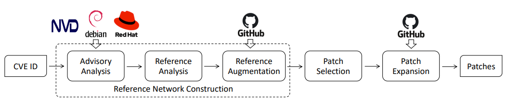
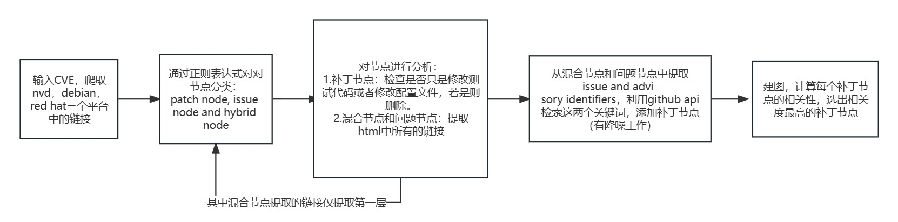

# Project Description

The Tracer project is an automated Python-based web crawler designed to track patches for open-source software (OSS) vulnerabilities. It utilizes multiple knowledge sources, including NVD, Debian, Red Hat, and GitHub, to automatically extract and analyze patch commits associated with a given vulnerability. 

## Modules and Tasks

### 1. Reference Network Construction

This module is responsible for constructing a reference network based on multiple knowledge sources. It takes a CVE identifier as input and retrieves relevant information from NVD, Debian, Red Hat, and GitHub. The tasks for this module include:

- Retrieving vulnerability reports, discussions, and resolutions.
- Parsing and extracting resource references.
- Building a network representation that models the relationships between resources, capturing the flow of information during vulnerability reporting, discussion, and resolution.

### 2. Patch Commit Selection

The Patch Commit Selection module focuses on identifying patch commits within the constructed reference network. It aims to select patch commits that have high connectivity and high confidence, indicating a higher likelihood of being relevant to the given CVE. The tasks for this module include:

- Analyzing the reference network to identify patch nodes (i.e., patch commits) with frequent references and strong connectivity.
- Applying confidence metrics to prioritize the selection of patch commits that are most likely to address the given vulnerability.
- Generating a list of selected patch commits for further analysis and tracking.

# Project Work Distribution

## Team Members

- Yiding : Project 
- Minhai : Reference Analysis

## Work Description

| Member | Work Description                                             |
| ------ | :----------------------------------------------------------- |
| Yiding | - Main Task : Initializing the reference network, obtaining advisories from various sources , extracting URL references from the advisories, and classifying the reference nodes.  - Input : CVE_ID list : list(str)   - Output : Reference Network(easy version) : dict()   - Due:  2023/10/11  function name:prune_node Input: Node Output: Node Description: 删除无代码修改的补丁节点 - Due:  2023/11/3 |
| Minhai | - Main Task : constructing the reference network in a layered way by applying two analyses to each reference node.  - Input :  Reference Network(easy version) : dict() - Output:  Reference Network(Complex version) : dict() - Due :  2023/10/17  function name:expand_treeInput: Node Output: Node Description: 拓展仍有可能成为补丁节点的子节点 - Due:  2023/11/3 |

